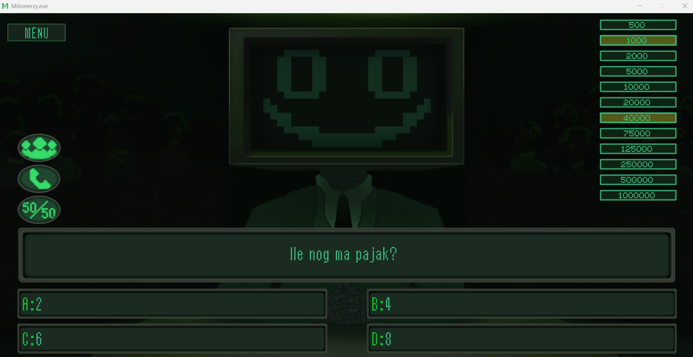
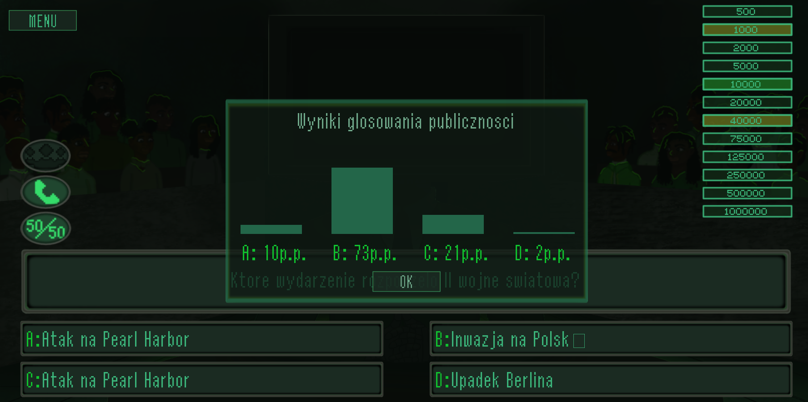
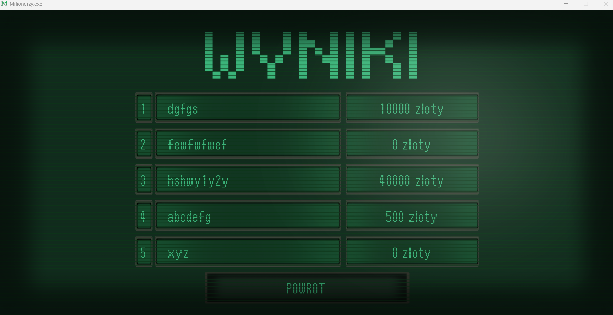

# 🎮 Milionerzy

**Milionerzy** is a student game project inspired by the *Who Wants to Be a Millionaire?* TV show, developed in **C** using the **Allegro 5** library.

---

## 📌 Project Overview

The project focuses on creating a complete 2D game experience, including graphics rendering, UI design, game logic, and audio integration.  
It was developed as part of a university course on the basics of programming in C.

---

## ✨ My Responsibilities

- Programming 2D graphics rendering using Allegro 5
- Designing the overall game layout and UI
- Creating all graphical assets
- Selecting and integrating sound effects
- Implementing question randomization based on increasing difficulty levels

---

## 🛠️ Technologies Used

- **C**
- **Allegro 5**

---

## 📷 Screenshots

### Game Screen

### Lifeline 

### Scoreboard

> *All graphics shown above were designed and drawn by me.*

---

## 🧠 What I Learned

- Rendering and managing 2D graphics using Allegro 5
- Designing a clear and readable game UI
- Structuring game logic in C
- Implementing randomized gameplay mechanics
- Combining graphics, sound, and logic into a complete game

*Created by: Mateusz Gozdek, Bartosz Fijołek, Karol Kroczek*